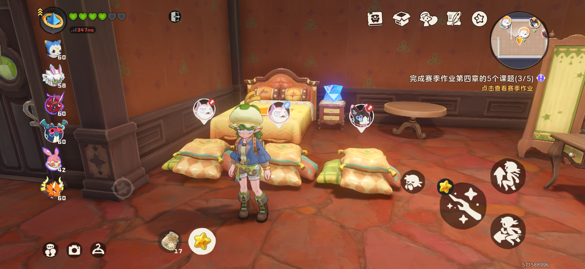

# how-unlucky-am-i
A Monte Carlo simulation project for estimating rare shiny egg probabilities in Roco Kingdom (a mobile game) using Python.

## Background
In Rock Kingdom, players can place pet nests in their home. When two pets of the same species are placed together, they may produce an egg. These eggs have a small chance of becoming a shiny egg, an alternate-color egg, or even a shiny alternate-color egg.

I placed ten pet nests in my home(which is the maximum each player could place in their home) and played for about two months, but I still did not get a single shiny or alternate-color egg. Out of frustration and curiosity, I decided to use probability and Python simulation to answer the question:

How unlucky am I, mathematically?

The exact base probability is unknown. The source only says that the normal rate is below 1%.

Because of this uncertainty, this project compares two assumptions:

- Conservative assumption: base rate = 0.1%
- High-rate assumption: base rate = 0.99%

Since all of my male breeding pets are rare-colored, I use a parent multiplier of 3.

## Egg Schedule

My egg production was not the same every day.

```text
Days 1-10: 2 eggs per day
Days 11-20: 3 eggs per day
Days 21-60: 6 eggs per day
```

The total number of eggs is:

```text
10 × 2 + 10 × 3 + 40 × 6 = 290 eggs
```

## What This Project Does

This project calculates the probability of getting zero shiny / rare-colored eggs after 290 eggs.

It uses two methods:

1. Exact mathematical calculation
2. Monte Carlo simulation

The exact formula is:

```text
Probability of zero special eggs = (1 - actual_rate)^total_eggs
```

The Monte Carlo simulation repeats the egg-breeding experiment many times. For example, it can simulate 10,000 players, where each player hatches 290 eggs. Then it estimates how often a player gets zero shiny / rare-colored eggs.

## Probability Assumptions

### Case 1: Conservative Assumption

```text
Base rate: 0.1% = 0.001
Parent multiplier: 3x
Actual rate per egg: 0.001 × 3 = 0.003 = 0.3%
```

Under this assumption:

```text
Probability of getting zero special eggs after 290 eggs ≈ 41.84%
Probability of getting at least one special egg ≈ 58.16%
```

This means getting zero shiny / rare-colored eggs is unlucky, but still very possible.

### Case 2: High-Rate Assumption

```text
Base rate: 0.99% = 0.0099
Parent multiplier: 3x
Actual rate per egg: 0.0099 × 3 = 0.0297 = 2.97%
```

Under this assumption:

```text
Probability of getting zero special eggs after 290 eggs ≈ 0.0160%
Probability of getting at least one special egg ≈ 99.9840%
```

This means that if the real base rate is close to 1%, then getting zero special eggs after 290 eggs would be extremely unlucky.

## Psychological Pity Table

There is no real guaranteed pity unless the game has a built-in pity system. These numbers only show how many eggs are needed to reach each probability level mathematically.

### Conservative Assumption: Actual Rate = 0.3%

```text
50% chance of at least one special egg: 231 eggs
80% chance of at least one special egg: 536 eggs
90% chance of at least one special egg: 767 eggs
95% chance of at least one special egg: 998 eggs
99% chance of at least one special egg: 1533 eggs
```

### High-Rate Assumption: Actual Rate = 2.97%

```text
50% chance of at least one special egg: 23 eggs
80% chance of at least one special egg: 54 eggs
90% chance of at least one special egg: 77 eggs
95% chance of at least one special egg: 100 eggs
99% chance of at least one special egg: 153 eggs
```

Under the high-rate assumption, 290 eggs is already far beyond the 99% psychological pity line.

## My egg nests
These are my egg nests in Rock Kingdom. They have been working for two months, but the shiny eggs are still missing.



